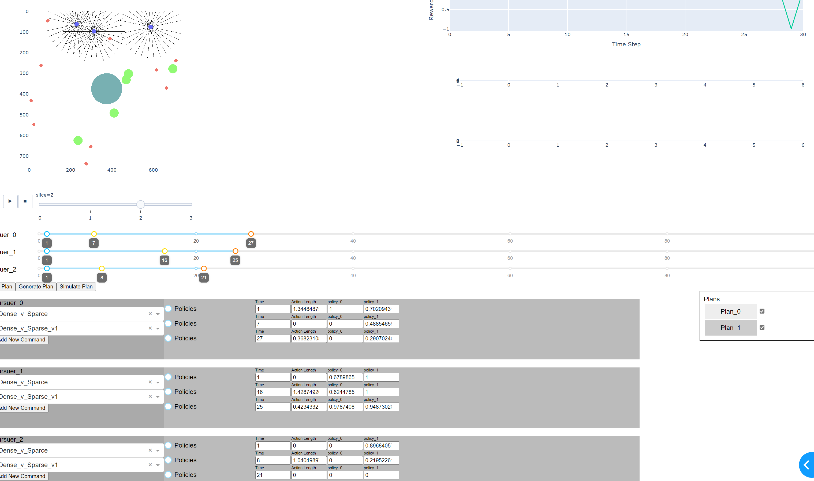

# Controller-Agnostic Orchestration Architecture (COACH)
## A Framework for Training Semi-Autonomous Agents and Directors Leveraging Existing Simulations

COACH is a system to turn (PettingZoo)[https://pettingzoo.farama.org/index.html] (PZ) compatible multiagent Gymnasium environments into agent orchestration and planning problems, using a director/actor hierarchical framework. Given any PZ environment and a set of agents trained to execute actions on that enviornemnt given asynchronous direction in terms of a __plan__," the COACH repo provides a wrapper to turn the problem into a planning simulation and a wrapper to turn such planning simulations into PZ compatible orchestration environments for raining director agents. In addition, it provides a prefab agents and an interactive plan visualization system using DASH. 

This library can be used as is, but has been deisgned as a starting point for interactive planning problems.



## Termanology:
A lot of the terminology around RL becomes contested when you move into the multiagent setting. For this library we will nail down the following conventions, with the explicit understand that they are not universal. We have tried, as much as possible, to keep the language as close to any standard we could find as possible. 

* Simulation - A (multiagent) simulation environment conforming to the (PettingZoo interface)[https://pettingzoo.farama.org/index.html]
* Agent - A piece of code that takes observations and returns actions. 
* Actor - An agent assigned to a specific role in multiagent simulation, and equiped with an instruction set (interface) for directing the actor. Actors are "interactive" or "directable" agents. Importantly, actors may be RL policy based, have multiple policies, use good-old-fashioned-ai, or be generated using any other method.
* Course Of Action (COA) - A set of directions for a particular actor, tagged to specific times in the language of the agents interface. 
* Plan - A set of courses of action, one for each role in the simulation. 
* COACH Environment - An environment for planning problems: Given a simulation and a set of actors filling the required roles, a directing agent generates a course of action for each agent to follow. The simulation is then run forward a number of steps (fixed, agent depenant, or agent dependant with blackout conditions), and the courses of action may be updated. 
* Director - An agent that takes observations recorded by actors, and generates a courses of action. 
* Trajectory - Action/observation/rewards for all agents over a period of time. 


# Getting started

For a good introduction, take a look at the examples provided in the examples folder. They give a demonstration of how to train and deploy a multi-policy actor with a director choosing which policy to use at a given time.

## Examples: 

### Multiploicy Director

In this example, we use StableBaselines3 and Supersuit to train two policies on the Waterworld environment from PettingZoo. One we train in a sparse food environment as an "explorer" agent, the other we train in a dense food and dense poison environment as a "dense" avoider agent. Finally, we train a director to select the policies each agent should use for the next 10 turns given their current observations. 

In this example we see how to train policies on a PettingZoo environment, use those policies and that PettingZoo environment to establish a planning problem using the coach environment. We then set up a communications schedule to allow communication every 10 turns and train the director agent to select between the policies. 

Finally, we construct a Dash app to display our solution.

This example uses all most entirely default functionality. For more advanced functionality see the MAInspection example. 

### Multiagent Inspection

This example shows how to solve a simple satelite inspection problem in two steps:
* First we train an agent not to solve the problem, but to use the environment to train an agent to go from one waypoint to another.
* After this "waypointer" 
agent is trained the director is then trained to select waypoints that easily solve the problem. 

This example also demonstrates how to create custom agents, a custom coach environment, custom trajectory classes and custom trajectory visualizations. 

## Overview of Environment Files:

* `coach.py` - Contains the class that wraps a PZ env, turning it into a planning environment.
```    
COACHEnvironemnt(
        env_creator: callable,
        parameter_generator:BaseParameterGenerator,
        agents=dict(),
        fill_random=True,
        comm_schedule:Timeline=None,
        seed=6234235,
        TrajectoryClass = Trajectory,
)
```
* * `env_creator` - A function that creates a parallel PettingZoo env. 
* * `parameter_generator` - A parameter generator object. Simulations call the parameter generator for samples. The BaseParameterGenerator simply returns the same parameters each time, the RandomParameterGenerator returns the same parameters but different seeds. 
* * `agents` - A dictionary of `role:agent` pairs. If not specified the DefaultActor agent will be used. 
* * `fill_random` - If `True` any agent roles not specified above will be set to the RandomActor agent. 
* * `comm_schedule` - A `utilities.planning.CommunicationsSchedule` object that determines contact times and blackout times for director/agent communication. 
* * `seed` - Random seed.
* * `TrajectoryClass` - Trajectories save agent history. By default all actions and step returns are saved, but if other information is required a different class can be passed. 

* `env.py` - PettingZoo env wrapping COACHEnvironemnt for training director agents. 
```    
COACH_PettingZoo(env_creator: callable, COACHEnvClass: COACHEnvironment)
```
* * `env_creator` - A function that creates a parallel PettingZoo env. 
* * `COACHEnvClass` - COACHEnvironemnt class that will be wrapped. 

## Overview of Auxiliary Files
* `agents.py` - Library of agents, sample agent classes include RandomActor, DefaultActor and SB_PPOPoliciesActor
* `params.py` - Standard MarcoPolo params functionality for evolving parameters
* `utilities.iotools.py` - Tools for saving and reloading
* `utilities.planning.py` - Holds timeline classes specifically for COACH, including `CommunicationsSchedule` and `COA`
* `utilities.PZParams.py` - Parameter file for environments from the PettingZoo library
* `utilities.PZWrapper.py` - Wrapper for environments from the PettingZoo library
* `utilities.timelines.py` - Timeline classes
* `utilities.tools.py` - Miscellaneous tools used by parts of the coach env. 

* `DASH` - Interactive Course Of Action viewer. See Multipolicy Example for more. 
* `examples` - Examples of how to use the coach environment. 