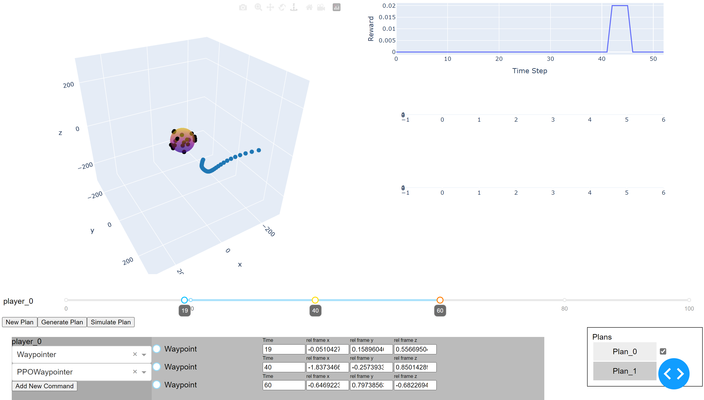

# Multiagent Inspection

This example shows how to solve a simple satelite inspection problem in two steps:
* First we train an agent not to solve the problem, but to use the environment to train an agent to go from one waypoint to another.
* After this "waypointer" 
agent is trained the director is then trained to select waypoints that easily solve the problem. 

This example also demonstrates how to create custom agents, a custom coach environment, custom trajectory classes and custom trajectory visualizations. 

