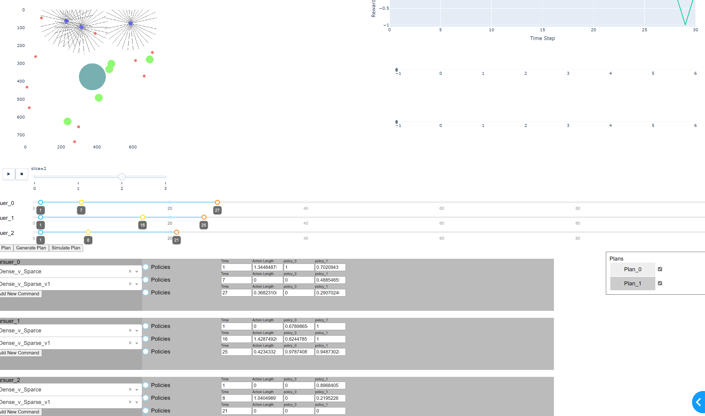

# Multiploicy Director

In this example, we use StableBaselines3 and Supersuit to train two policies on the Waterworld environment from PettingZoo. One we train in a sparse food environment as an "explorer" agent, the other we train in a dense food and dense poison environment as a "dense" avoider agent. Finally, we train a director to select the policies each agent should use for the next 10 turns given their current observations. 

In this example we see how to train policies on a PettingZoo environment, use those policies and that PettingZoo environment to establish a planning problem using the coach environment. We then set up a communications schedule to allow communication every 10 turns and train the director agent to select between the policies. 

Finally, we construct a Dash app to display our solution.

This example uses all most entirely default functionality. For more advanced functionality see the MAInspection example. 

